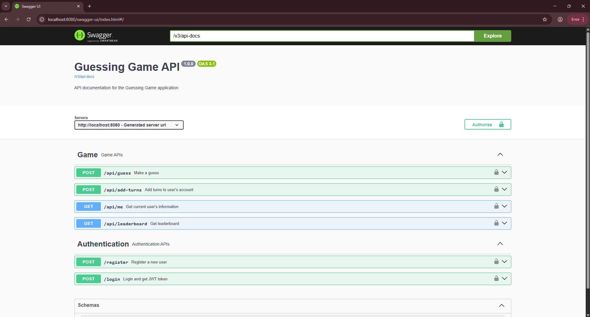
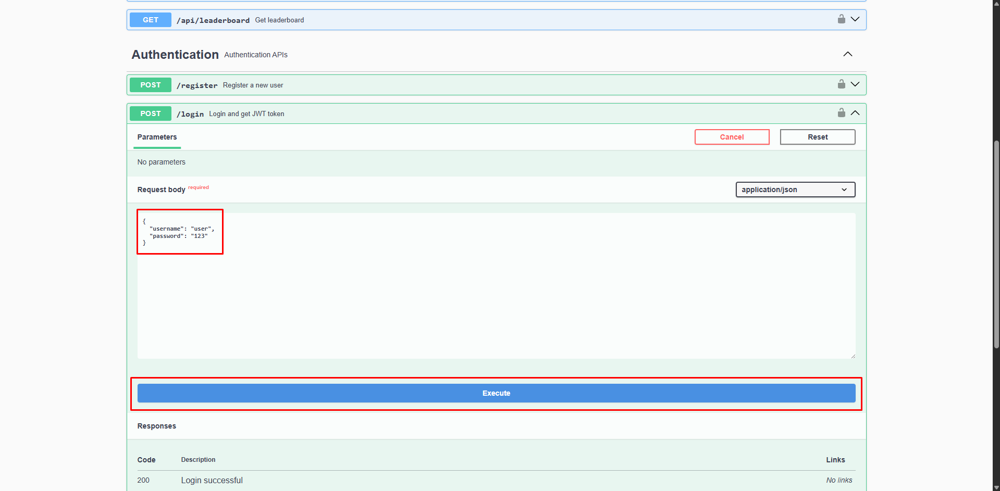
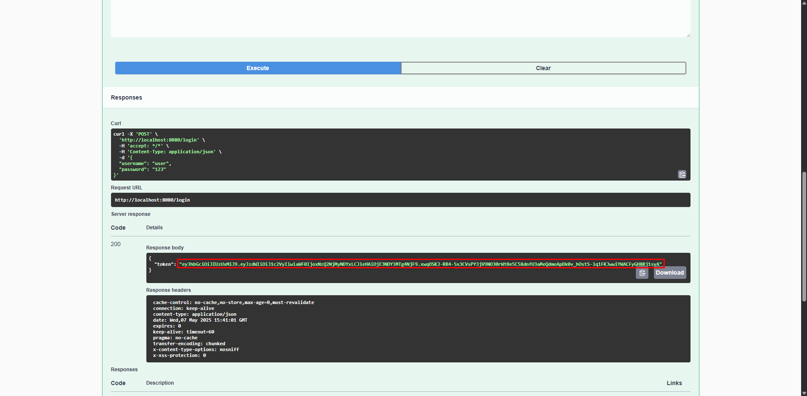
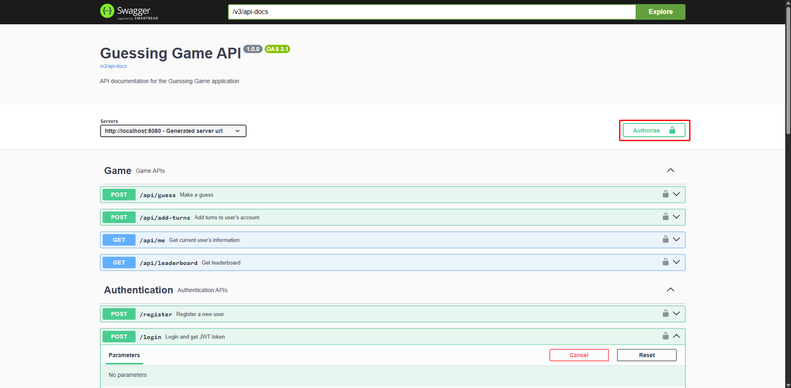
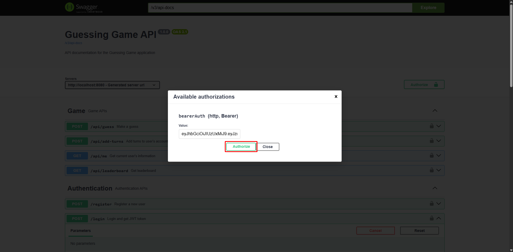
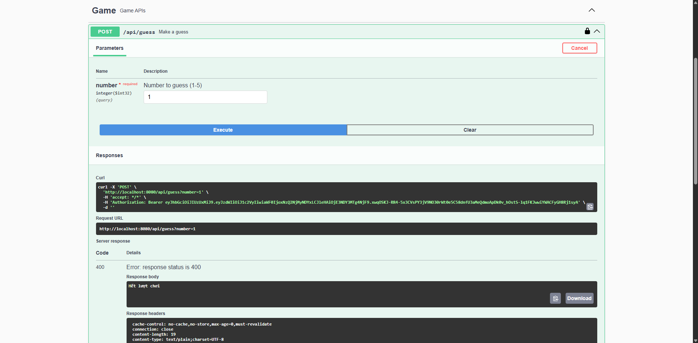
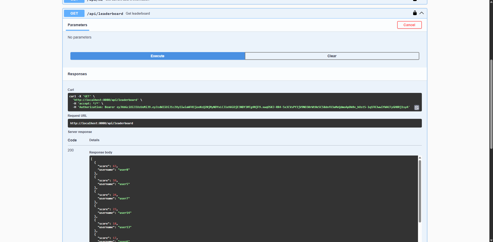
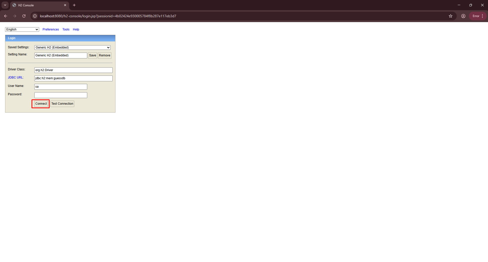
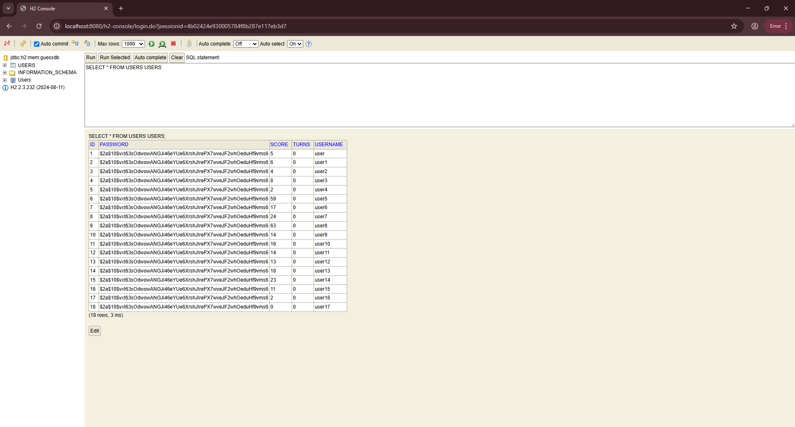

# 🎮 Game Đoán Số - Backend API

Ứng tuyển vị trí Backend - Java Spring Boot  
Ứng dụng mini API cho game đoán số từ 1–5, có hệ thống điểm, lượt chơi, bảng xếp hạng, và bảo mật JWT.

---

## 🚀 Yêu cầu môi trường

- Java 17 hoặc mới hơn  
- Gradle 7+ (hoặc dùng `./gradlew`)  
- IDE khuyến nghị: IntelliJ IDEA hoặc VS Code  
- (Tùy chọn) Postman hoặc Swagger UI để test API

---

## 🔧 Setup & Chạy ứng dụng

### 1. Clone project
```bash
git clone https://github.com/nguyenson257/guessing-game.git
cd guessing-game
```
### 2. Chạy ứng dụng
Nếu bạn dùng Gradle wrapper:

```bash
./gradlew bootRun
```
Hoặc với Gradle cài sẵn:

```bash
gradle bootRun
```
Truy cập Swagger UI tại: 👉 http://localhost:8080

## 📂 Cấu hình
Cấu hình chính nằm trong file: src/main/resources/application.properties

```bash
# JWT
jwt.secret=yourSuperSecretKeyHere
jwt.expiration=86400000

# Game
game.win-rate=0.05

# H2 Console
spring.h2.console.enabled=true
spring.h2.console.path=/h2-console

# DB in-memory
spring.datasource.url=jdbc:h2:mem:testdb
spring.datasource.driver-class-name=org.h2.Driver
spring.datasource.username=sa
spring.datasource.password=
spring.jpa.hibernate.ddl-auto=update
```

## 🔐 Xác thực
Hệ thống sử dụng JWT để bảo mật API.
Đăng ký và đăng nhập sẽ trả về token.

Cách lấy token:
```bash
POST /login
Content-Type: application/json

{
"username": "admin",
"password": "123456"
}
```
Token trả về sẽ dùng cho các API cần xác thực:
```bash
Authorization: Bearer <your_token_here>
```
## 🔍 API Chính
| Method | Endpoint        | Mô tả                                     |
|--------|-----------------|-------------------------------------------|
| POST   | /register       | Đăng ký user mới                          |
| POST   | /login          | Đăng nhập, trả về JWT token               |
| POST   | /guess?number=3 | Đoán số từ 1–5                            | 
| POST   | /add-turns      | Cộng 5 lượt chơi                          | 
| GET    | /leaderboard    | Trả về top 10 người chơi có điểm cao nhất | 
| GET    | /me             | Thông tin user hiện tại                   | 

## 🧪 Test API
Truy cập Swagger UI tại: 👉 http://localhost:8080/swagger-ui/index.html

Hoặc dùng Postman / curl để test thủ công.

## 🗃 Dữ liệu mặc định
Ứng dụng khởi chạy sẽ tạo sẵn user mẫu:

| Username | Password |
|----------|---------|
| user     | 123     |
| user1    | 123     |
| user2    | 123     |
| user3    | 123     |

## 📘 Ghi chú
Nếu dùng Swagger UI, hãy click nút Authorize góc phải để dán token JWT.

Bạn có thể chỉnh sửa xác suất thắng (game.win-rate) hoặc thời gian sống của JWT (jwt.expiration) trong file application.properties.

## NÂNG CAO
### Nếu 1 user gọi /guess nhiều lần cùng lúc, xử lý sao để đảm bảo tính đúng đắn của api?

- Dùng Lock theo userId, lock record của user đang đoán và unlock sau khi đoán xong.
- Tạo 1 hàng đợi xử lý request đoán số cho mỗi user.

### Đảm bảo khi hệ thống có lượng user lớn, các api /leaderboard, /me vẫn trả kết quả nhanh

- /leaderboard (Top 10 người điểm cao):
  - Indexing cột score và sắp xếp DESC LIMIT 10.
  - Dùng cache (Redis/Memcached).
- /me (trả về info user hiện tại)
  - Lấy từ token (JWT)
  - Cache theo userId

## Hướng dẫn test nhanh các API 
- Sau khi chạy ứng dụng có thể 
  - test nhanh API với Swagger UI tại: 👉 http://localhost:8080/swagger-ui/index.html
  - Xem DB tại: 👉 http://localhost:8080/h2-console
### Demo

Login

Copy token và thêm vào Authorize của Swagger và click Authorize



Bắt đầu test API mong muốn


Xem DB


